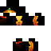

# Minecraft Skin Generator

Python tool to convert a photo to a Minecraft skin.

## What is it...?

Minecraft allows users to create and customise their skins and use these in the Minecraft game.
Each skin is defined as a bitmap with a specific format which is uploaded to the Minecraft server.
There are many online skin editors on the internet, but these all require you to painstakingly edit the skins - clicking each pixel, choosing a colour etc.

What I wanted was a way to choose a photo and have this 'wrapped' around my Minecraft character.
This is the program I came up with - a python script which processes a photo and outputs a Minecraft skin.

For example, if you give it a photo like this:


the script will generate a Minecraft skin file like this:


If you load this into Minecraft, you will be able to run around looking like a pumpkin. Something like this:

TODO


## How does it work...?

The script uses the PIL (Python Imaging Library) to load the photo and manipulate it.

A dictionary is created to define the format of a Minecraft skin. This simplifies the building of the skin later on, and allows body parts to be accessed more easily ('headTop', 'rightArmTop' etc). The format is taken directly from the wiki page and consists of the co-ordinates of the part in the skin, and the corresponding co-ordinates in the photo. These values are used to move to/from the different co-ordinate spaces in the skin/photo.

The main program loads the provided photo. A set of co-ordinates are provided to tell the code where to start extracting the skin (allows you to choose the best part of the photo). Before starting, it resizes the photo to match the resolution of the Minecraft skin.

The main heavy lifting is done by the set of mappings. These tell the program where to find pieces of the skin in the source photo. This is constructed by iterating over each body part in our dictionary and deciding if it can be taken from the photo (some body parts don't look good when taken from the photo, and are instead painted with a colour). If it should be copied from the photo, the corresponding photo co-ordinates are taken.

Once we have built the entire set of mappings, the transformImage function builds a skin, using the mappings to cut out each body part.

As an additional step, the program also generates a version of the skin in a more visual form (imagine unfolding a paper dice). This is not used directly, but can help check that the skin is correct before uploading it. Again, this is just created by building a reverse set of mappings (this time from the skin instead of the photo). This is the main advantage of treating everything as a series of transformations.

## How do I use it...?
Just give the program a photo to use, and add the x, y offset where to start:

```
python photo2skin.py photo.jpg 3 5
```

The program creates 2 files:
* photo-skin.png - the skin to upload
* photo-thumb.png - a flattenned version of the skin showing the piece of the photo that has been used

Then just upload the skin to Minecraft via the Minecraft web pages.

## Files

* The main program is photo2skin.py.
* A short helper library is in mylib.py
* There are some sample 'paint' colours to draw the legs, arms etc (lightGrey.png, darkGrey.png, blue.png, green.png). You can edit the program to change which body parts get painted with which colour. There is even a commented out line to paint all body parts in black (black.png). It's up to you.

Run the unit tests in test_photo2skin.py using pytest.

Enjoy!!!
